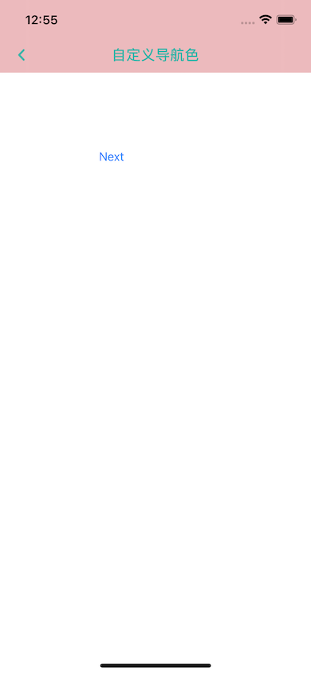
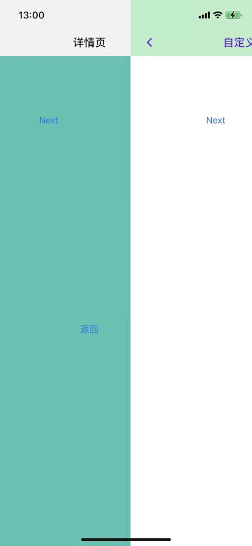

# STNavigationController

[](https://travis-ci.org/猪猪行天下/STNavigationController)
[](https://cocoapods.org/pods/STNavigationController)
[](https://cocoapods.org/pods/STNavigationController)
[](https://cocoapods.org/pods/STNavigationController)

## 介绍

本项目是参考[JTNavigationController](https://github.com/ikanam/JTNavigationController)的swift版本(去掉了全屏返回手势)，并进行了扩展优化

越来越多的应用为每一个 **VC** 设置单独的导航条，而不是之前那样使用一个全局统一的导航条，因为不同的 **VC** 有不同的视觉样式，前一个是蓝色的，后一个也许要做成红色、透明，或者干脆没有导航条。

虽然开发者可以在每个 **VC** 的 `viewWillAppear(_ animated: Bool)` 方法中设置自己所需的样式，但是在同一个导航条上来回修改，稍不注意就会导致样式混乱。另一种实现方式，是隐藏全局那个导航条，每个 **VC** 自己通过 `addSubview(_ view: UIView)` 的方式自己设置导航条。这种实现是可行的，但是使用不方便了，如：
- 无法使用 `self.navigationItem.rightBarButtonItem` 等来设置导航按钮，而必须自己手动往 `navigationBar` 上加；
- 无法使用 `self.title` 来修改导航标题，而必须自己添加监听；
- 无法方便地设置 `navigationBarHidden`；
- 无法方便地自动调整 `contentInsets`。

等等。

本项目提供一种透明的方式，让开发者像以前一样使用导航器，同时，每个 `push` 进来的 **VC** 有自己独立的导航条。





## 导航结构

使用`STNavigationController`，你的**ViewController**的层级结构将发生改变：

```
STNavigationController
    `- ContainViewController
    |       `- ContainNavigationController
    |               `- YourViewController1
    `- ContainViewController
            `- ContainNavigationController
                    `- YourViewController2
```

## 集成方法

### CocoaPods

安装只需将以下行添加到Podfile文件中即可 :

```ruby
pod 'STNavigationController'
// 或
pod 'STNavigationController', :git => "https://github.com/zhuzhuxingtianxia/STNavigationController.git"

```

### Swift Package Manager

* File > Add Packages
* 搜索 `https://github.com/zhuzhuxingtianxia/STNavigationController.git` 搜索到后点击Add Package
* "Up to Next Major"选择一个最新的版本

如果SPM加载太慢：

* 下载项目到指定目录
* 打开个人项目`File > Add Packages > Add Local`
* 选择下载项目`Package.swift`所在的目录文件添加本地库管理
* `TARGET > General > Frameworks,Libraries,and Embedded Content` 点击+选择添加的package

<!----
Add Packages遇到的问题：
**unexpected return value from ssl handshake -9806**
* `cd` 到项目目录
* 执行`xcodebuild -resolvePackageDependencies -scmProvider system
`

**SecureTransport error: connection closed via error (-1)**
可以参考 [解决swift package manager fetch慢的问题](https://www.cnblogs.com/vlucht/p/15015875.html)中的第三种方案。试了下是可以的

---->

## 实例

* 首先`import STNavigationController`
* 然后将原来的`UINavigationController`替换为`STNavigationController`即可.

使用与原生导航方法一致：
```
navigationController?.pushViewController(vc, animated: true)
// 返回
navigationController?.popViewController(animated: true)
// 返回到跟视图
navigationController?.popToRootViewController(animated: true)

//返回到指定界面
if let vc = navigationController?.st.viewControllers.first(where: { $0.isKind(of: DetailViewController.self) }) {
       navigationController?.popToViewController(vc, animated: true)
   }

```
获取STNavigationController导航栈：
```
let nav = self.st.navigationController
```
获取容器ContainController
```
let containViewController = self.st.containViewController
```
获取导航容器中我们自己的viewControllers
```
let viewControllers = navigationController?.st.viewControllers
```

修改导航栈移除前一个界面：
```
if let containNav = st.navigationController {
  containNav.viewControllers = containNav.viewControllers.filter({ vc in
      let count = containNav.viewControllers.count
      return containNav.viewControllers[count - 2] != vc
  })
}
```

添加了导航扩展，修改导航栏颜色
```
navigationController?.barTintStyle(.white)
```
导航栏样式：
```
public enum NavigationBarStyle: Equatable {
    //白色背景，黑色字体
    case white
    // 自定义
    case custom(_ bgColor: UIColor, tintColor: UIColor)
    //透明背景，白色字体
    case clear
    //自定义导航背景图片，默认黑色字体
    case theme(_ image: UIImage,tintColor: UIColor?)
}
```
修改控制器状态栏
```
self.st.statusBarStyle(.lightContent)
// 获取
override var preferredStatusBarStyle: UIStatusBarStyle {
   return st.statusBarStyle
}
```
当前界面设置是否支持侧滑返回, 默认true
```
popGestureEnabled = false
```

## 注意点
在有`TabBar`显示的界面，到界面底部的距离会有一个导航栏高度的偏移。
`self.view`的高度是屏幕高度：

* 使用`frame`布局时，需要考虑导航的高度和tabbar的高度

* 使用约束布局时，只需考虑tabbar的高度

```
scrollView.snp.makeConstraints { make in
       make.top.left.right.equalToSuperview()
       make.bottom.equalToSuperview().offset(-(tabBarController?.tabBar.frame.height ?? 0))
   }
```

* 设置导航透明`navigationController?.barTintStyle(.clear)`时，布局需要向上偏移一个导航的高度

* 通过`window.rootViewController`遍历查找`currentViewController`时，可能获取到的是包装后的控制器，所以需要找到我们自己的控制器
```
if let vc = currentCV, vc.isKind(of: ContainViewController.self) {
       currentCV = (vc as? ContainViewController)?.rootViewController
   }
```

## License

STNavigationController is available under the MIT license. See the LICENSE file for more info.


